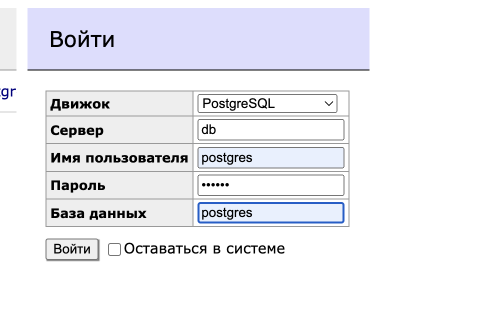

# Readers journal 1.0.0

## Быстрые ссылки:
* [PSQL](#1-postgressql)
* [Backend](#2-backend)
* [Frontend](#3-frontend)
* [Docker-compose](#4-docker-compose-бд)
* [Troubleshooting](#возникновение-проблем)

## 1. PostgresSQL

Создайте пользователя с паролем:

```
CREATE USER postgres WITH PASSWORD dbpass;
```

Создайте БД:

```
CREATE DATABASE book_clients OWNER postgres;
```

Создайте таблицу:

```
CREATE TABLE books(
name VARCHAR(150),
year int,
genre VARCHAR(150),
author VARCHAR(150),
id SERIAL PRIMARY KEY,
instock int);
```

Затем импортируйте данные.
CSV-файл таблицы лежит в корне проекта.

## 2. Backend

Backend использует .env переменные, которые указаны в файле:

```dotenv
PORT=5000
JWT_SECRET_KEY=gfg_jwt_secret_key
TOKEN_HEADER_KEY=gfg_token_header_key
DB_HOST=localhost
DB_PORT=5432
DB_NAME=book_clients
```

Установка и запуск:

```shell
cd backend
npm i
npm start
```

## 3. Frontend

Пароль и логин от личного кабинета:
Login: admin,
Password: 1234

Установка и запуск:

```shell
cd frontend
npm i
npm start
```

Frontend использует .env

```dotenv
REACT_APP_BASE_URL=http://localhost:5001
```

## 4. Docker-compose БД

Поднять БД и админ панель с помощью docker-compose:

```shell
cd ./db
docker-compose up -d
```

Зайти в контейнер с postgres 
нужно выполнять в директории db!!!

```shell
cd ./db
docker-compose exec db sh
```

Либо:

```shell
docker-compose exec db bash
```

Логин заданного пользователя внутри контейнера `db`:

`postgres` - заданный пользователь при создании контейнера

```shell
su - postgres
```

Пишем `psql` чтобы попасть в СУБД,`-d book_clients` - указываем имя БД

```shell
psql -d book_clients
```

Делаем запрос в таблицу `books`: 

```
SELECT * FROM books;
```

Будет доступна админка adminer на
[localhost:8080](http://localhost:8080)



пароль: dbpass

## Возникновение проблем:

1. При добавлении новой записи БД отдает ошибку: `duplicate key value violates unique constraint "books_pkey"`

Баг при инкременте id.
Нужно проверить `id` последней записи в таблице и следующего значения из генератора последовательности.
Затем сравнить значения:

Получаем `id` последней добавленной записи в таблице:

```
SELECT MAX(id) from books; 
```

Получаем значение из генератора последовательности `books_id_seq` :

```
SELECT nextVal('"books_id_seq"');
```

Если значение генератора больше, например (3>2), повторить запрос на добавление записи в БД.
Если значение меньше или равно, выполнить команду:

```
SELECT setval('"table_name_id_seq"', (SELECT MAX(id) FROM table_name)+1);
```
Значение в генераторе станет равно значению `id` последней записи в таблице + 1

Повторить запрос на добавление записи в БД.